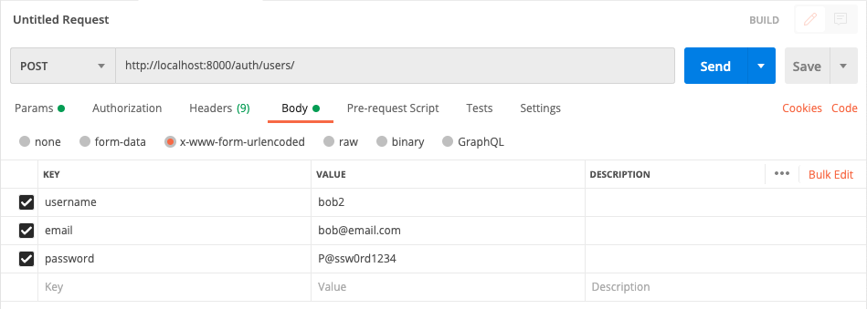
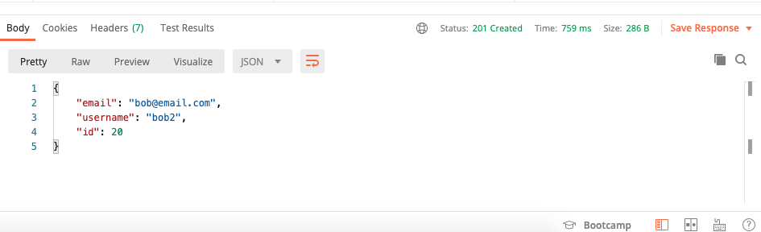

# Testing Your Django REST API

The Django REST Framework is a great add-on to Django that you will likely be using to create your projects.  It features a rich GUI that allows you to examine endpoints and make requests easily.  This is great for quick testing as you are developing your app.

However, if you find yourself wanting to create multiple test users, or populate your database with consistent dummy data, the GUI quickly becomes burdensome.  Adding the same data one piece at a time, and having to repeat yourself over and over again can be both frustrating and waste valuable development time.  This is especially true when you add JWT authentication into the mix because protected endpoints must have a token in the header.

There are a number of ways you can test your REST API, but I will show you two basic ways that don't require additional testing frameworks (testing frameworks are good, this is not meant to be a replacement).

## Postman

The first is Postman.  You can download Postman [here](https://www.postman.com/downloads/).  It allows you to make requests, and save those requests for reuse later.  

Postman's main screen looks like this: 

To make a new request, click on the tab. 

From there you can choose the request method (GET, POST, etc.), the url, 

and the headers/body:

Let's walk through testing a user interaction with our app.  We will:
1. Create a new user
2. Get the user's token
3. Use the token to access a protected resource

### 1. Create a new user
To create a new user, our particular API requires a POST request to http://localhost:8000/auth/users/.  In addition we also need to send the user's username, email and password (that we would get from a form on our front-end).  We can add that user information to body by clicking on the "Body" tab.  There we will add our key/value pairs in the x-www-form-urlencoded format:

We can then make the request by clicking "Send".  If the request was successful, you should see something similar to the response below:

Note especially the status, in our case "201 Created".  If your request failed, you will also see the response there.

## Plain Old Python
You can also more thoroughly automate basic testing/setup by using a script.  In fact, one of the benefits of REST APIs is that you can use a script to interact with them.  