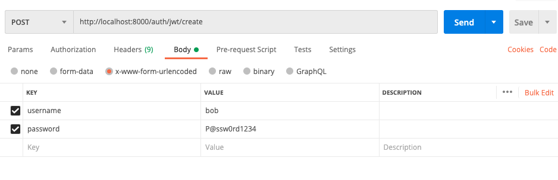

# Testing Your Django REST API

The Django REST Framework is a great add-on to Django that you will likely be using to create your projects.  It features a rich GUI that allows you to examine endpoints and make requests easily.  This is great for quick testing as you are developing your app.

However, if you find yourself wanting to create multiple test users, or populate your database with consistent dummy data, the GUI quickly becomes burdensome.  Adding the same data one piece at a time, and having to repeat yourself over and over again can be both frustrating and a waste of valuable development time.  This is especially true when you add JWT authentication into the mix because protected endpoints must have a token in the header.

There are a number of ways you can test your REST API, but I will show you two basic ways that don't require additional testing frameworks (testing frameworks are good, this is not meant to be a replacement).

## Postman
The first is Postman.  You can download Postman [here](https://www.postman.com/downloads/).  It allows you to make requests, and save those requests for reuse later.  

Postman's main screen looks like this: 


Click on "Create a request":


From there you can choose the request method (GET, POST, etc.), the url, and the headers/body.

Let's walk through testing a user interaction with our app (a Django REST API using djangorestframework-simplejwt).  We will:

1. Create a new user
2. Get the user's token
3. Use the token to access a protected resource

### 1. Create a new user
To create a new user, our particular API requires a POST request to http://localhost:8000/auth/users/.  In addition we also need to send the user's username, email and password (that we would get from a form on our front-end).  We can add that user information to the body by clicking on the "Body" tab.  There we will add our key/value pairs in the x-www-form-urlencoded format:


We can then make the request by clicking "Send".  If the request was successful, you should see something similar to the response below:


Note especially the status, in our case "201 Created".  This means that you should now have a new user.  You can double-check using the admin GUI. If your request failed, you will also see the response there.

### 2. Get the user's token
Since we are using JWTs to manage access to our application, we need our server to generate and send a token that the client can send along with future requests to protected endpoints.

In our example API, the endpoint to obtain a user's token is: http://localhost:8000/auth/jwt/create.  

The request is very similar to what we did when we created a new user.  We make a POST request, but include only the username and password in the request's body:



Note: You can also send JSON directly by choosing the "raw" radio button.

If the request is successful, you should be returned your token (you will likely get both a "refresh" and "access" token.  For now we will ignore the "refresh" token):


### 3. Use the token to access a protected resource
Once we obtain a user's token, we must include it in requests to protected endpoints.  The standard way of doing this is to include the token in the "Authorization" header.

In this example, we will be making a GET request to a protected resource: http://localhost:8000/auth/users/me:


You will need to get your access token from step 2, create an "Authorization" header, and paste the token in:


Note: The standard format is Bearer + space + token.  However, your specific implementation might vary slightly.

If your request is successful, you will see whatever the server returns from that endpoint.


## Plain Old Python
Postman is great for quick testing.  But what if you want to create a bunch of test users as you are developing your REST API?  What if you want to populate your database with a standard set of dummy data for testing?

For this situation, using Postman quickly becomes tedious and time-comsuming.

A better alternative to more thoroughly automate basic testing/setup is to use a script.  In fact, one of the main benefits of REST APIs is that you can use scripts to interact with them.  

We can replace the three steps above with three functions.

```python
import requests

BASE_URL = "http://localhost:8000/auth/"

def signup():
    url = BASE_URL + "users/"
    payload = {
        'username': 'testUser3', 
        'password': 'P@ssw0rd1234', 
        'email': 'email@mail.com'
        }
    r = requests.post(url, data=payload)
    if r.status_code == 201:
        print("Successfully signed up")
    else:
        print("Failed to sign up")

def get_token():
    url = BASE_URL + "jwt/create/"
    payload = {
        'username': 'testUser', 
        'password': 'P@ssw0rd1234', 
        }
    r = requests.post(url, data=payload)
    if r.status_code == 200:
        token = r.json()["access"]
        print("Successfully obtained token")
        return token
    else:
        Print("Failed to obtain token")
        return None

def get_user_info(token):
    url = BASE_URL + "users/me/"
    headers = {'Authorization': 'Bearer ' + token}
    r = requests.get(url, headers=headers)
    if r.status_code == 200:
        print("used token to access user info")


if __name__ == "__main__":
    signup()
    token = get_token()
    get_user_info(token)

```

The third function "get_user_info" would represent any protected endpoint.

This takes more time initially, but will save you time in the long run if you frequently need to create/recreate a test user.

However, we can still improve this.  As it is now, the script is not very reusable or orgainized.  If we wanted to create a more robust system, we could convert this into a class, with some additional features:

```python
import requests
import logging

logging.basicConfig(format='%(levelname)s:%(message)s', level=logging.INFO)

class TestUserAuth:

    BASE_URL = "http://localhost:8000/auth/"
    SUCCESS_CODES = [200, 201]

    def __init__(self, username, password, email):
        self.user_pass = {
            'username': username, 
            'password': password, 
        }
        self.email = email
        self.token = None
        self.signup_url = self.BASE_URL + "users/"
        self.get_token_url = self.BASE_URL + "jwt/create/"
        self.get_user_info_url = self.BASE_URL + "users/me/"

    def signup(self):
        email = {'email': self.email}
        payload = {**self.user_pass, **email}
        r = self.handle_request(self.signup_url, "POST", payload)
        if r.status_code in self.SUCCESS_CODES:
            self.log_message(logging.INFO, f"Successfully signed up {self.user_pass}")
        else:
            self.log_message(logging.WARN, f"Failed to sign up {self.user_pass}")

    def get_token(self):
        payload = self.user_pass
        r = self.handle_request(self.get_token_url, "POST", payload)
        if r.status_code in self.SUCCESS_CODES:
            token = r.json()["access"]
            self.token = token
            self.log_message(logging.INFO, f"Successfully obtained token for {self.user_pass}")
        else:
            self.log_message(logging.WARN, f"Failed to obtain token for {self.user_pass}")

    def get_user_info(self):
        if self.token == None: raise Exception("You do not have a token yet")
        headers = {'Authorization': 'Bearer ' + self.token} 
        r = self.handle_request(self.get_user_info_url, "GET", headers)
        if r.status_code in self.SUCCESS_CODES:
            self.log_message(logging.INFO, f"used token to access user info for {self.user_pass}")
        else:
            self.log_message(logging.WARN, f"unable to access resource using token for {self.user_pass}")

    def handle_request(self, url, method, extra):
        try:
            if method == "GET":
                return requests.get(url, headers=extra)
            elif method == "POST":
                return requests.post(url, data=extra)
        except:
            self.log_message(logging.WARN, "Request failed")

    def log_message(self, level, message):
        if level == 20: logging.info('%s', message)
        if level == 30: logging.warning('%s', message)

    def run(self):
        self.signup()
        self.get_token()
        self.get_user_info()


if __name__ == "__main__":
    test_user_base = "testUser"
    num_users = 10

    for i in range(1, num_users):
        user = TestUserAuth(f"{test_user_base}{i}", "P@ssw0rd1234", f"{test_user_base}{i}@email.com")
        user.run()
```

This implementation allows us to easily create any number of users instantly. There are lots of possible improvements, and it might look like overkill, but it's closer to what you would see in an actual codebase.  

You could easily extend this by creating a CSV file with dummy users and/or dummy data.  You could read from that file and populate your database with a consistent set of users and/or dummy data for testing purposes.

There are many testing frameworks out there that do similar things, but it is often just as easy to do it yourself using what you know about HTTP, REST APIs, and programming.